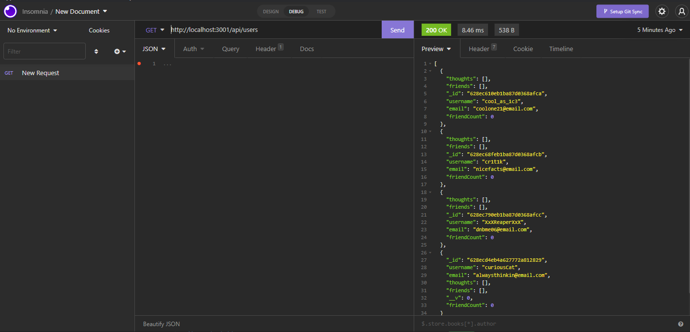

# Social Network API
      
 ## Table of Contents 

      
-----------------------------------------

      
 - [Description](#description) 

      
 - [Showcase](#link) 

      
 - [Installation Instructions](#install)

      
 - [Usage Information](#usage) 

      
 - [Questions?](#email) 

      
 ## Description 

      
-----------------------------------------

      
 Creating a social network API using routing methods from mongoose and MongoDB. This application simulates a social media experience containing different users with thoughts as their posts and the ability to view their friends and reaction to their thoughts.

      
 ## Showcase

      
-----------------------------------------
 
      
 

      
 ## Installation Instructions

      
-----------------------------------------
 
      
 Please run `npm i` to install required dependencies then `npm start` to load the db

      
 ## Usage Information 

      
-----------------------------------------
 
      
  This application uses `mongoose`, `express` and `MongoDB`. Please use Insomnia or Postman to test.

      
 

      
 ## Questions?

      
-----------------------------------------
 
      
  My Github: [Akuruu](https://github.com/Akuruu)

      
 Contact Me: anjalismith0529@gmail.com 
